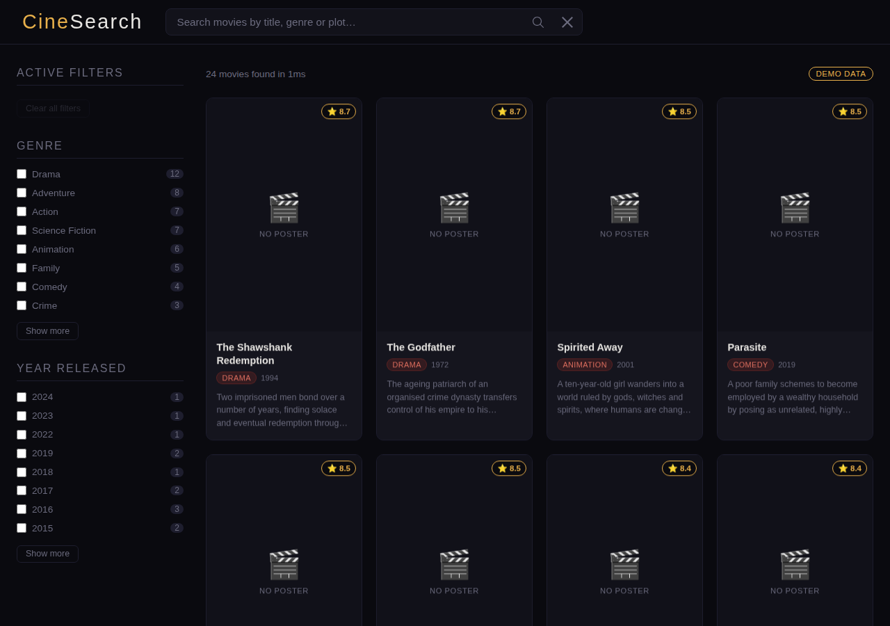
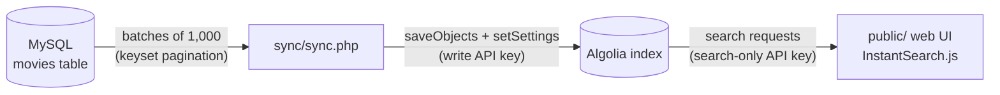

# CineSearch — Movie Search Engine

[](https://github.com/Wendy-Calma/WENDY-SIA-LAB/actions/workflows/ci.yml)


A batch sync job that indexes a MySQL movie catalogue into **Algolia**, and an
**instant-search** web front end on top of that index — search-as-you-type,
typo tolerance, highlighting, genre and year facets, and pagination.


<sub>Screenshot with the sample movie catalogue.</sub>

---

## How it works



1. **Extract** — `sync/sync.php` reads the `movies` table in batches using
   keyset pagination (`WHERE id > ?`), which stays fast on large tables.
2. **Transform** — each row is normalised into an Algolia record
   (`sync/lib.php`): comma-separated genres become an array, the release year
   is derived for faceting, ratings are cast to numbers.
3. **Load** — records are pushed with `saveObjects`, then the index settings
   are applied: searchable attributes, facets, and custom ranking by rating.
4. **Search** — the static front end in `public/` queries Algolia directly from
   the browser with a search-only key, so there is no backend to host.

## Features

- ⚡ Instant search with highlighted matches and typo tolerance
- 🎭 Genre and release-year filters, with active-filter chips and "clear all"
- ⭐ Results ranked by relevance, then by rating
- 🔗 Search state kept in the URL, so results can be bookmarked and shared
- 📱 Responsive layout, graceful poster fallbacks, clear error states
- 🔐 Secrets loaded from `.env`; only a search-only key ever reaches the browser
- 🧪 Demo mode: with no Algolia app configured (or if it is unreachable), the UI
  searches a built-in sample catalogue instead, so the live demo never breaks

## Tech stack

| Layer    | Technology                                          |
|----------|-----------------------------------------------------|
| Source   | MySQL                                               |
| Sync job | PHP 8.1+, PDO, `algolia/algoliasearch-client-php` v4 |
| Search   | Algolia                                             |
| Front end| HTML, CSS, JavaScript, InstantSearch.js v4          |
| CI/CD    | GitHub Actions (tests + GitHub Pages deploy)        |

## Project structure

```
.
├── database/
│   ├── schema.sql        # movies table definition
│   ├── seed.sql          # sample rows to try the pipeline
│   └── movies.json       # sample records for a no-code upload in the Algolia dashboard
├── public/               # static front end (deployed to GitHub Pages)
│   ├── index.html
│   ├── css/styles.css
│   └── js/
│       ├── config.js     # Algolia app ID, search-only key, index name, demo mode
│       ├── app.js        # InstantSearch widgets and templates
│       ├── demo-search.js # in-browser search client used in demo mode
│       └── demo-data.js  # sample movies for demo mode
├── sync/
│   ├── sync.php          # MySQL → Algolia batch job
│   └── lib.php           # .env loading and record transformation
├── tests/LibTest.php     # unit tests for the transformation logic
├── .env.example
└── composer.json
```

## Getting started

### Prerequisites

- PHP 8.1+ with the `pdo_mysql` extension, and [Composer](https://getcomposer.org/)
- MySQL 8 (or MariaDB)
- A free [Algolia](https://www.algolia.com/) account

### 1. Install and configure

```bash
git clone https://github.com/Wendy-Calma/WENDY-SIA-LAB.git
cd WENDY-SIA-LAB
composer install
cp .env.example .env      # then fill in your MySQL and Algolia credentials
```

### 2. Create the database

```bash
mysql -u root -p < database/schema.sql
mysql -u root -p moviedb < database/seed.sql   # optional sample data
```

### 3. Sync MySQL to Algolia

```bash
composer sync
```

```
Starting sync: MySQL `moviedb.movies` → Algolia index 'movies'
------------------------------------------------------------
  Synced 6 records (total 6, last id 6)
------------------------------------------------------------
Records synced: 6
Applying index settings…
Sync complete.
```

> **No MySQL?** You can skip steps 2–3 and upload `database/movies.json` in the
> Algolia dashboard instead (Search → your index → *Add records* → *Upload file*),
> then set the same searchable attributes, facets and ranking that `sync.php` applies.

### 4. Run the front end

Put your App ID, **search-only** key and index name in `public/js/config.js`, then:

```bash
composer serve            # http://localhost:8000
```

### Demo mode

The front end also runs with no Algolia account at all. `demoMode` in
`public/js/config.js` controls this:

| Value              | Behaviour                                                                  |
|--------------------|----------------------------------------------------------------------------|
| `'auto'` (default) | Use Algolia when configured; otherwise, or if a request fails, use sample data |
| `true`             | Always use the sample data                                                 |
| `false`            | Algolia only                                                               |

In demo mode, `public/js/demo-search.js` implements the parts of the Algolia
search API that InstantSearch uses (prefix matching, facet counts, facet
filters, pagination and highlighting) over `public/js/demo-data.js`, and a
**Demo data** badge is shown next to the result count.

## API keys and security

| Key                   | Where it lives        | Permissions                 |
|-----------------------|-----------------------|-----------------------------|
| Write / Admin key     | `.env` (git-ignored)  | `addObject`, `editSettings` |
| Search-only key       | `public/js/config.js` | `search` only               |

The search-only key is meant to be public — Algolia's design has browsers
query the index directly. The write key never leaves the machine that runs the
sync job.

## Testing

```bash
composer test
```

CI runs PHP linting, the unit tests and a JavaScript syntax check on every push
and pull request.

## Deployment

On every push to `main`, the `public/` folder is published to GitHub Pages by
[`.github/workflows/pages.yml`](.github/workflows/pages.yml). Enable it once
under **Settings → Pages → Source: GitHub Actions**.

## Author

**Wendy Rizza V. Calma** — [github.com/Wendy-Calma](https://github.com/Wendy-Calma)

## License

[MIT](LICENSE)
